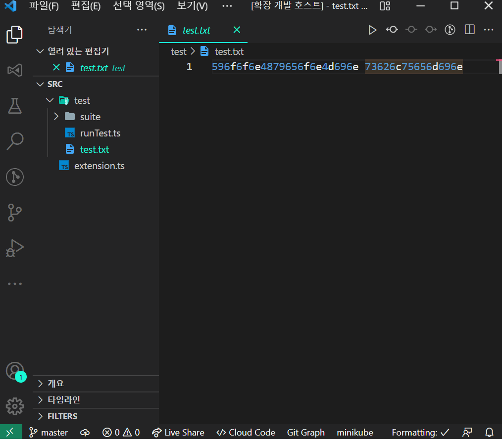

# Hex to ASCII Extension 
This is an extension that converts to ASCII regardless of endianness.

## Features
1. Hex to Ascii string

2. Find ascii string

# References
- [Microsoft samples](https://github.com/microsoft/vscode-extension-samples)
